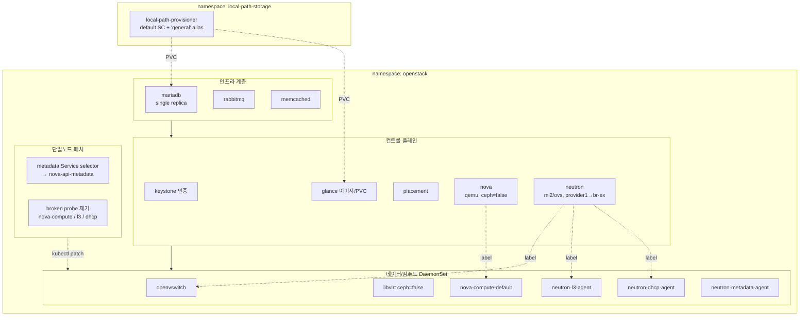
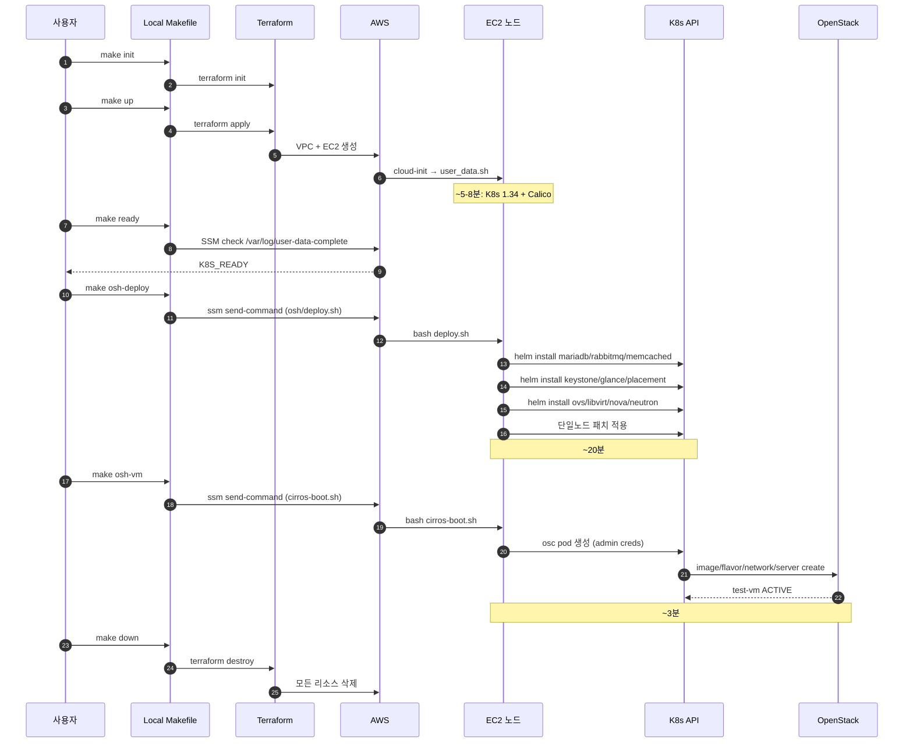
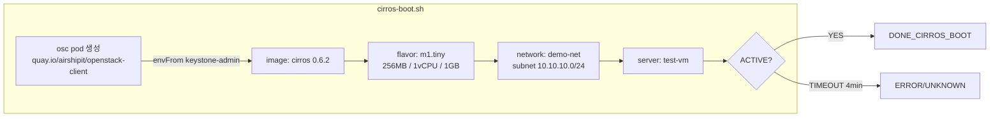

# openstack-aws — OpenStack-Helm 단일 노드 학습 랩

AWS EC2 한 대 위에 Kubernetes + OpenStack-Helm 2026.1.0 (Keystone / Glance / Nova / Neutron / Placement) 을 띄우고 CirrOS VM 부팅까지 검증하는 학습용 실습 환경.

**한 사이클 ≈ 30분 / 비용 ≈ $1.3 (m5.4xlarge 1시간 가정).**

## 빠른 시작

```bash
make init           # 처음 한 번
make up             # EC2 + VPC 생성 (~2분)
make ready          # K8s 부트스트랩 완료 대기 (~3분)
make osh-deploy     # OpenStack-Helm 풀스택 (~20분)
make osh-vm         # CirrOS VM 부팅 검증 (~3분)
make down           # 끝나면 반드시
```

각 명령이 정확히 무엇을 하는지, 막혔을 때 어디를 보는지는 아래 문서들에 있습니다.

## 아키텍처 도식

### 전체 아키텍처

```mermaid
flowchart LR
    subgraph Local["로컬 노트북"]
        MK[Makefile]
        TF[terraform/]
        SH[osh/*.sh]
        AWS_CLI[aws cli]
    end

    subgraph AWS["AWS ap-northeast-2"]
        direction TB
        subgraph VPC["VPC 10.0.0.0/16"]
            IGW[Internet Gateway]
            subgraph Subnet["public subnet 10.0.1.0/24"]
                subgraph EC2["EC2 m5.4xlarge / Ubuntu 24.04 / gp3 100GB"]
                    K8S[K8s 1.34 단일노드]
                    OSH[OpenStack-Helm 2026.1.0]
                    K8S --- OSH
                end
            end
            SG[Security Group<br/>egress-only]
            IAM[IAM Role<br/>SSMManagedInstanceCore]
        end
    end

    Local -. SSM Session Manager .-> EC2
    Local -. SSH 안 씀 .x EC2
    EC2 --- SG
    EC2 --- IAM
    Subnet --- IGW
```

### Terraform 인프라 구성

```mermaid
flowchart TB
    subgraph TFD["terraform/"]
        PROV[providers.tf<br/>AWS Seoul]
        VPC_TF[vpc.tf<br/>VPC + subnet + IGW + SG]
        IAM_TF[iam.tf<br/>IAM role + instance profile]
        EC2_TF[ec2.tf<br/>m5.4xlarge + gp3 100GB]
        UD[user_data.sh]
        OUT[outputs.tf<br/>instance_id, region]
    end

    EC2_TF -->|user_data| UD
    EC2_TF -->|iam_instance_profile| IAM_TF
    EC2_TF -->|subnet_id + sg| VPC_TF

    subgraph Boot["user_data.sh 부팅 단계"]
        direction TB
        S1[1.base pkgs / swap off / sysctl]
        S2[2.containerd SystemdCgroup=true]
        S3[3.kubeadm/kubelet/kubectl v1.34]
        S4[4.kubeadm init<br/>pod-cidr 192.168.0.0/16]
        S5[5.Calico v3.32 server-side apply]
        S6[6.untaint control-plane + helm]
        S7[7.Calico Ready 대기]
        DONE[/var/log/user-data-complete]
        S1-->S2-->S3-->S4-->S5-->S6-->S7-->DONE
    end

    UD --> Boot
```

### OpenStack-Helm 스택 (deploy.sh 결과)



### make 사이클 시퀀스



### CirrOS VM 부팅 검증 흐름



## 문서 목차

1. [설치](docs/1-install.md) — 로컬 도구 / AWS 자격증명 / 한 줄 사이클
2. [설치 확인](docs/2-verify.md) — 노드 진입, `KUBECONFIG` 설명, 3계층 점검 (K8s → OpenStack → end-to-end VM)
3. [K8s와 OpenStack 연계 구조](docs/3-architecture.md) — Deployment / DaemonSet / StatefulSet / Job 매핑, Service DNS, Secret 흐름, 가상화 경로
4. [OpenStack 이용 (놀이터)](docs/4-using-openstack.md) — `openstack` CLI로 VM 띄우고 끄고 네트워크 만들기
5. [트러블슈팅](docs/5-troubleshooting.md) — 에러 cheatsheet, osh-deploy 진행도 확인, 5가지 함정과 해결
6. [운영 — 비용과 사이즈](docs/6-cost.md) — AWS 인스턴스 선택지 비교, 한 사이클 비용 시나리오
7. [디자인 결정 메모](docs/7-design-decisions.md) — 왜 SSH 안 씀 / 왜 m5.4xlarge / 왜 release tag 고정 / 왜 Ingress 생략 / 스토리지(local-path·Rook-Ceph·Cinder LVM) 선택

## 저장소 구조

```
.
├── Makefile                # make up / down / osh-deploy / osh-vm 등 단축 명령
├── docs/                   # 위 7개 문서
├── terraform/              # AWS 인프라
│   ├── providers.tf        #   AWS provider (Seoul 리전)
│   ├── vpc.tf              #   VPC + 퍼블릭 서브넷 + egress-only SG
│   ├── iam.tf              #   SSM Session Manager용 IAM 역할 (SSH 안 씀)
│   ├── ec2.tf              #   m5.4xlarge Ubuntu 24.04, 100GB gp3
│   ├── user_data.sh        #   부팅 시 K8s 1.34 + Calico v3.32 + helm 자동 설치
│   ├── outputs.tf          #   instance_id, region, ssm_command 출력
│   └── variables.tf
└── osh/                    # OpenStack-Helm 배포 (노드에서 실행)
    ├── deploy.sh           #   OSH 2026.1.0 컴퓨트 코어 풀스택 설치 (~20분)
    └── cirros-boot.sh      #   CirrOS VM 부팅으로 검증 (~3분)
```

## 처음이라면

`make help`로 사용 가능한 타겟 확인 → [1. 설치](docs/1-install.md)부터 차례로.

이미 한 번 띄워본 적 있다면 → [2. 설치 확인](docs/2-verify.md) (점검 명령어 모음) 또는 [4. OpenStack 이용](docs/4-using-openstack.md) (놀이터)로 바로.

막혔다면 → [5. 트러블슈팅](docs/5-troubleshooting.md).
