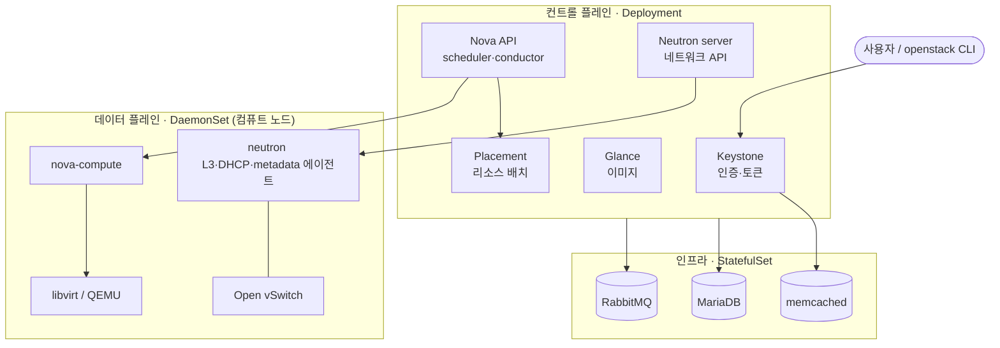
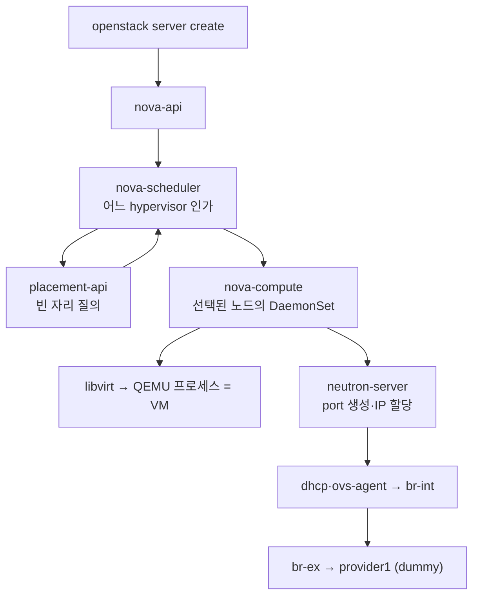

# K8s와 OpenStack은 어떻게 연계돼 있나

OpenStack-Helm 은 모든 OpenStack 컴포넌트를 Kubernetes 리소스(Deployment / DaemonSet / StatefulSet / Job)로 띄운다. 전부 `openstack` 네임스페이스에서 동작하며, 이 랩은 단일 노드라 컨트롤 플레인과 데이터 플레인이 같은 노드에 함께 올라온다.

## 전체 구조



각 K8s 리소스 종류가 맡는 역할:

| K8s 리소스 | 무엇을 띄우나 | 개수(이 랩) |
|---|---|---|
| **Deployment** | 상태 없는 컨트롤 플레인 API·스케줄러·컨덕터 | 11 |
| **DaemonSet** | 컴퓨트 노드에 1:1로 배치되는 데이터 플레인(hypervisor·network 에이전트·OVS) | 8 |
| **StatefulSet** | 영구 상태가 있는 인프라(DB·MQ·캐시) | 3 |
| **Job** | 일회성 부트스트랩(DB 스키마, keystone 등록) | ~38 |

`kubectl -n openstack get {deploy,ds,sts,jobs}` 로 자기 클러스터의 수치를 확인한다.

## 컨트롤 플레인 — Deployment

상태가 없고 어느 노드에 올라와도 되며, 보통 1 replica 다(HA 구성 시 늘린다). `openstack-control-plane=enabled` 라벨이 붙은 노드에 배치된다.

| 서비스 | Deployment | 역할 |
|---|---|---|
| **Keystone** | `keystone-api` | identity·토큰 발급. 모든 다른 서비스의 인증 기반 |
| **Glance** | `glance-api` | 이미지 저장·조회(PVC `glance-images` 에 qcow2 보관) |
| **Nova** | `nova-api-osapi` | 사용자가 입력하는 `openstack server ...` 를 수신 |
|  | `nova-api-metadata` | VM 안에서 169.254.169.254 로 호출하는 메타데이터 서버 |
|  | `nova-conductor` | DB 접근 중개(compute 가 DB 에 직접 접근하지 않음) |
|  | `nova-scheduler` | 어느 하이퍼바이저에 VM 을 배치할지 결정 |
|  | `nova-novncproxy` | 브라우저에서 VM 콘솔 접속 |
| **Neutron** | `neutron-server` | network·subnet·port API |
|  | `neutron-rpc-server` | 에이전트와의 RPC 분리(성능용) |
| **Placement** | `placement-api` | 리소스 인벤토리·할당(Nova 가 빈 자리를 placement 에 질의) |
| (MariaDB) | `mariadb-controller` | MariaDB Galera 상태 머신 컨트롤러 |

## 데이터 플레인 — DaemonSet

노드에 1:1로 배치되는 것(가상화 호스트, OVS 브리지, 네트워크 에이전트). 라벨 셀렉터로 어느 노드에 올릴지 결정하며, 이 랩은 단일 노드라 모두 같은 노드에 하나씩 올라온다.

| DaemonSet | 라벨 셀렉터 | 역할 |
|---|---|---|
| `libvirt-libvirt-default` | `openstack-compute-node=enabled` | QEMU/KVM hypervisor 데몬. host `/var/lib/libvirt` 마운트 |
| `nova-compute-default` | `openstack-compute-node=enabled` | nova-compute(libvirt 와 통신해 실제 VM 생성) |
| `openvswitch` | `openvswitch=enabled` | OVS vswitchd·ovsdb-server. br-int / br-ex 생성 |
| `neutron-ovs-agent-default` | `openvswitch=enabled` | VM port 가 생성되면 OVS 에 attach |
| `neutron-l3-agent-default` | `l3-agent=enabled` | 가상 라우터(네트워크 간 라우팅) |
| `neutron-dhcp-agent-default` | `dhcp-agent=enabled` | VM 에 IP 할당(dnsmasq) |
| `neutron-metadata-agent-default` | `metadata-agent=enabled` | VM 의 169.254.169.254 요청을 nova-api-metadata 로 프록시 |
| `neutron-netns-cleanup-cron-default` | (compute) | 사용하지 않는 netns 정리 cron |

`osh/deploy.sh` Step 5 에서 노드에 다음 라벨을 모두 부여해, 단일 노드가 컨트롤·데이터 플레인 역할을 동시에 한다.

```text
openstack-control-plane, openstack-compute-node,
openvswitch, linuxbridge, ovs-host,
l3-agent, dhcp-agent, metadata-agent
```

## 인프라 의존성 — StatefulSet

영구 상태가 있고 ordering 이 중요한 인프라다.

| StatefulSet | 역할 | 의존하는 쪽 |
|---|---|---|
| `mariadb-server` | OpenStack 의 모든 메타데이터 DB | 거의 모든 서비스 |
| `rabbitmq-rabbitmq` | RPC 메시지 큐(oslo.messaging) | nova·neutron·placement·glance 에이전트 |
| `memcached-memcached` | keystone 토큰 캐시 | keystone(성능) |

## Jobs — 일회성 부트스트랩

OpenStack 은 DB 가 비어 있으면 스키마부터 만들고, keystone 에 자기 자신을 등록해야 동작한다. OSH 는 이를 모두 K8s Job 으로 만든다.

| Job 이름 패턴 | 무엇을 |
|---|---|
| `*-db-init`, `*-db-sync` | DB 사용자 생성, 스키마 마이그레이션 |
| `*-rabbit-init` | RabbitMQ 사용자·vhost 생성 |
| `*-ks-user`, `*-ks-service`, `*-ks-endpoint` | keystone 에 user·service·endpoint 등록 |
| `keystone-fernet-setup`, `keystone-credential-setup` | 토큰 서명 키 생성 |
| `nova-bootstrap`, `nova-cell-setup` | placement 에 hypervisor 등록 대기·nova cell 초기화 |
| `glance-metadefs-load` | glance metadata definitions |

`kubectl -n openstack get jobs` 에서 `Completions 1/1` 이면 성공이며, 다시 실행되지 않는다.

## 자격증명 흐름

각 서비스가 keystone 에 admin 으로 호출할 때 쓸 자격증명을 Secret 으로 보관한다.

```text
secret/keystone-keystone-admin   ← 실제 cloud admin
secret/glance-keystone-admin
secret/neutron-keystone-admin
secret/nova-keystone-admin
secret/placement-keystone-admin
```

`keystone-keystone-admin` Secret 이 담고 있는 키는 그대로 OpenStack CLI 환경변수가 된다.

```text
OS_AUTH_URL  OS_USERNAME  OS_PASSWORD  OS_PROJECT_NAME
OS_PROJECT_DOMAIN_NAME  OS_USER_DOMAIN_NAME  OS_DEFAULT_DOMAIN
OS_REGION_NAME  OS_INTERFACE
```

`osc` 파드의 Pod spec 에 다음이 있어서 `openstack` CLI 를 별도 source 없이 바로 쓴다(`osh/cirros-boot.sh` 12-27행 참조).

```yaml
envFrom:
- secretRef:
    name: keystone-keystone-admin
```

## 서비스 디스커버리 — K8s Service + cluster.local

`openstack endpoint list` 에 나오는 URL 은 전부 K8s Service FQDN 이다.

```text
keystone     public    http://keystone.openstack.svc.cluster.local
keystone     internal  http://keystone-api.openstack.svc.cluster.local:5000/v3
nova         public    http://nova.openstack.svc.cluster.local/v2.1/%(tenant_id)s
neutron      public    http://neutron.openstack.svc.cluster.local
glance       public    http://glance.openstack.svc.cluster.local
placement    public    http://placement-api.openstack.svc.cluster.local:8778/
```

즉 서비스 간 통신은 모두 K8s in-cluster DNS 로 이뤄진다. 클러스터 밖에서 호출하려면 ingress 나 NodePort 가 필요한데, 이 랩은 학습용이라 두지 않았다.

## 스토리지

| 컴포넌트 | StorageClass | 크기 | 용도 |
|---|---|---|---|
| `glance-images` PVC | `general` | 2Gi | 업로드된 OS 이미지(qcow2) |
| MariaDB PV | `local-path` | (chart 기본) | DB 데이터 |
| RabbitMQ PV | `local-path` | (chart 기본) | MQ 상태 |

실제 provisioner 는 둘 다 같은 `rancher.io/local-path` 다. 일부 차트가 `class_name: general` 을 하드코딩하고 있어서, 같은 provisioner 를 가리키는 alias `general` 을 추가로 만들어 둔다([함정](../operations/troubleshooting.md) 참고).

## 가상화·네트워크 흐름

VM 이 부팅될 때 일어나는 일이다.



- **br-int** = integration bridge. 모든 VM port 가 여기에 묶인다.
- **br-ex** = external bridge. tenant network 가 외부로 나가는 출구다.
- **provider1** = 본래 host NIC 여야 하지만, 단일 노드 랩이라 `ip link add provider1 type dummy` 로 만든 가짜 인터페이스다. neutron 의 `auto_bridge_add: br-ex: provider1` 을 만족시키는 용도다.
- **QEMU 모드(nested KVM 아님)** — m5 인스턴스는 nested KVM 이 안 되므로 `virt_type=qemu` 소프트웨어 에뮬레이션을 쓴다. 컴퓨트가 CPU 를 많이 쓰는 이유다.
